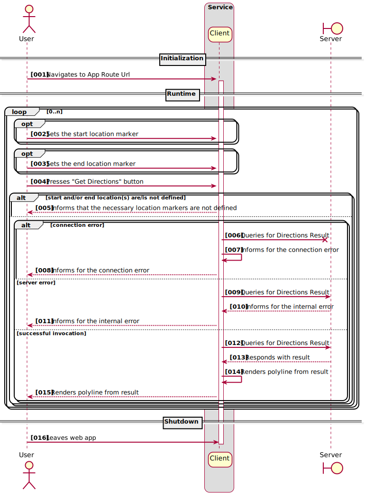

# Directions Map Reduce Client

[](https://travis-ci.com/steve-papadogiannis/dist-sys-client-vue)
[](https://snyk.io/test/github/steve-papadogiannis/dist-sys-client-vue)

A small project where the user selects a starting, and an ending location in a 
Google Maps element and queries an **Directions Map Reduce Server** 
(_[dist-sys-server-scala](https://github.com/steve-papadogiannis/dist-sys-server-scala)_) at the configured 
hostname/port.

## Version

* Node: 12.18.4
* Npm: 6.14.6
* Vue: 2.6.11
* Vuex: 3.4.0
* Vue-router: 3.2.0
* Axios: 0.21.1
* Vue2-google-maps: 0.10.7

## Sequence Diagram



## Project setup

In the project directory a `.env.local` file should be created with the below content:

```properties
VUE_APP_API_KEY=<Google Maps Javascript API Key>
```

The **VUE_APP_** prefix is necessary for **Vue** to resolve the value and the `.env.local` is 
used in order to avoid committing/pushing the secret **Api Key**

Issue the below command in project's directory to install the project dependencies:

```shell
npm install
```

## Build and Run

Issue the below command in project's directory:

```shell
npm run serve
```

Application will be bound to http://localhost:8383/

If different hostname or/and port is/are preferred, changes in the content:

```properties
VUE_APP_HOST_NAME=localhost
VUE_APP_PORT=8383
```

of `.env.development` file should be made.

## Run unit tests

Issue the below command in project's directory:

```shell
npm run test:unit
```

## Run end-to-end tests

Issue the below command in project's directory:

```shell
npm run test:e2e
```

## Linting

Issue the below command in project's directory:

```shell
npm run lint
```
